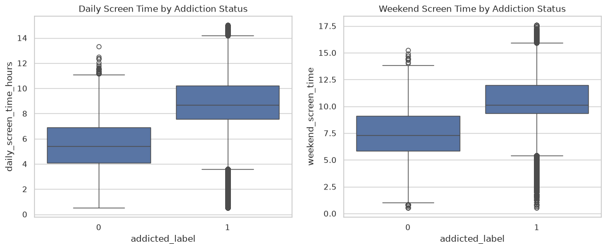
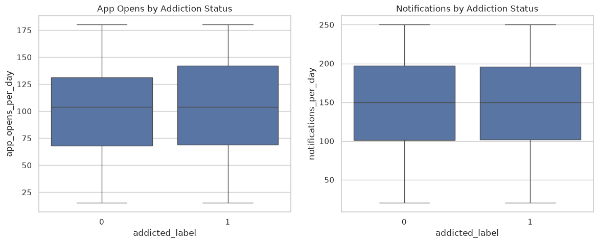
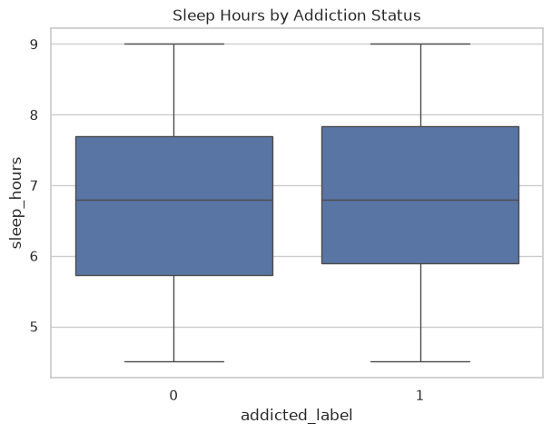
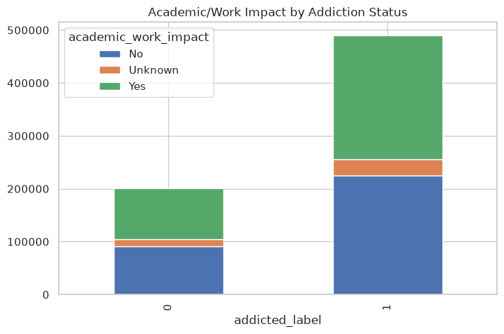
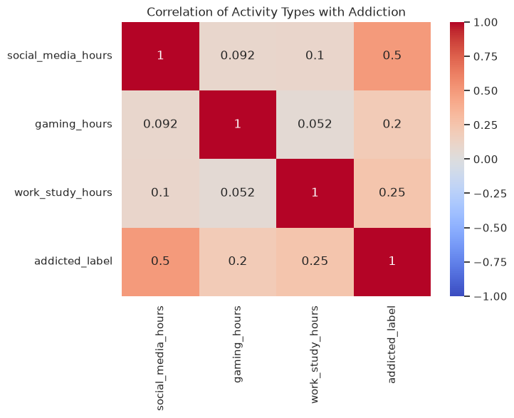

# Predicting Smartphone Addiction: Initial Data Exploration

This notebook performs an initial exploratory data analysis on the `train.csv` dataset, checking for missing values, basic statistics, and validating a few initial hypotheses.


```python
import pandas as pd
import numpy as np

# Load the dataset
df = pd.read_csv('train.csv')

# Quick preview
df.head()
```


<div>
<style scoped>
    .dataframe tbody tr th:only-of-type {
        vertical-align: middle;
    }

    .dataframe tbody tr th {
        vertical-align: top;
    }

    .dataframe thead th {
        text-align: right;
    }
</style>
<table border="1" class="dataframe">
  <thead>
    <tr style="text-align: right;">
      <th></th>
      <th>id</th>
      <th>age</th>
      <th>daily_screen_time_hours</th>
      <th>social_media_hours</th>
      <th>gaming_hours</th>
      <th>work_study_hours</th>
      <th>sleep_hours</th>
      <th>notifications_per_day</th>
      <th>app_opens_per_day</th>
      <th>weekend_screen_time</th>
      <th>gender</th>
      <th>stress_level</th>
      <th>academic_work_impact</th>
      <th>addicted_label</th>
    </tr>
  </thead>
  <tbody>
    <tr>
      <th>0</th>
      <td>0</td>
      <td>24.0</td>
      <td>7.77</td>
      <td>1.830000</td>
      <td>1.590000</td>
      <td>2.110000</td>
      <td>7.46</td>
      <td>122.0</td>
      <td>38.0</td>
      <td>8.63</td>
      <td>Male</td>
      <td>Medium</td>
      <td>No</td>
      <td>1</td>
    </tr>
    <tr>
      <th>1</th>
      <td>1</td>
      <td>19.0</td>
      <td>5.97</td>
      <td>1.080000</td>
      <td>1.330000</td>
      <td>3.030000</td>
      <td>8.22</td>
      <td>76.0</td>
      <td>19.0</td>
      <td>9.58</td>
      <td>Female</td>
      <td>Medium</td>
      <td>No</td>
      <td>0</td>
    </tr>
    <tr>
      <th>2</th>
      <td>2</td>
      <td>18.0</td>
      <td>5.09</td>
      <td>2.013339</td>
      <td>1.159195</td>
      <td>1.917466</td>
      <td>6.25</td>
      <td>134.0</td>
      <td>60.0</td>
      <td>7.47</td>
      <td>Female</td>
      <td>Low</td>
      <td>Yes</td>
      <td>0</td>
    </tr>
    <tr>
      <th>3</th>
      <td>3</td>
      <td>21.0</td>
      <td>6.42</td>
      <td>1.260000</td>
      <td>1.420000</td>
      <td>3.360000</td>
      <td>8.85</td>
      <td>112.0</td>
      <td>94.0</td>
      <td>8.66</td>
      <td>Other</td>
      <td>Low</td>
      <td>Unknown</td>
      <td>1</td>
    </tr>
    <tr>
      <th>4</th>
      <td>4</td>
      <td>26.0</td>
      <td>11.20</td>
      <td>1.870000</td>
      <td>2.810000</td>
      <td>1.950000</td>
      <td>5.25</td>
      <td>150.0</td>
      <td>104.0</td>
      <td>13.39</td>
      <td>Female</td>
      <td>Medium</td>
      <td>No</td>
      <td>1</td>
    </tr>
  </tbody>
</table>
</div>


## Basic Information
Let's look at the shape of the data, column types, and missing values.


```python
print(f"Number of Rows: {df.shape[0]}")
print(f"Number of Columns: {df.shape[1]}")

print("\n--- Missing Values ---")
print(df.isnull().sum())
```

    Number of Rows: 691369
    Number of Columns: 14
    
    --- Missing Values ---
    id                         0
    age                        0
    daily_screen_time_hours    0
    social_media_hours         0
    gaming_hours               0
    work_study_hours           0
    sleep_hours                0
    notifications_per_day      0
    app_opens_per_day          0
    weekend_screen_time        0
    gender                     0
    stress_level               0
    academic_work_impact       0
    addicted_label             0
    dtype: int64


## Summary Statistics
Let's check the mean, min, and max for our numerical columns.


```python
df.describe().loc[['mean', 'min', 'max']].T
```


<div>
<style scoped>
    .dataframe tbody tr th:only-of-type {
        vertical-align: middle;
    }

    .dataframe tbody tr th {
        vertical-align: top;
    }

    .dataframe thead th {
        text-align: right;
    }
</style>
<table border="1" class="dataframe">
  <thead>
    <tr style="text-align: right;">
      <th></th>
      <th>mean</th>
      <th>min</th>
      <th>max</th>
    </tr>
  </thead>
  <tbody>
    <tr>
      <th>id</th>
      <td>345684.000000</td>
      <td>0.00</td>
      <td>691368.00</td>
    </tr>
    <tr>
      <th>age</th>
      <td>26.631501</td>
      <td>18.00</td>
      <td>35.00</td>
    </tr>
    <tr>
      <th>daily_screen_time_hours</th>
      <td>7.689204</td>
      <td>0.50</td>
      <td>15.00</td>
    </tr>
    <tr>
      <th>social_media_hours</th>
      <td>2.412758</td>
      <td>0.00</td>
      <td>8.00</td>
    </tr>
    <tr>
      <th>gaming_hours</th>
      <td>1.422904</td>
      <td>0.00</td>
      <td>4.00</td>
    </tr>
    <tr>
      <th>work_study_hours</th>
      <td>2.344051</td>
      <td>0.00</td>
      <td>6.00</td>
    </tr>
    <tr>
      <th>sleep_hours</th>
      <td>6.804055</td>
      <td>4.50</td>
      <td>9.00</td>
    </tr>
    <tr>
      <th>notifications_per_day</th>
      <td>146.296189</td>
      <td>20.00</td>
      <td>250.00</td>
    </tr>
    <tr>
      <th>app_opens_per_day</th>
      <td>102.795922</td>
      <td>15.00</td>
      <td>180.00</td>
    </tr>
    <tr>
      <th>weekend_screen_time</th>
      <td>9.496097</td>
      <td>0.51</td>
      <td>17.56</td>
    </tr>
    <tr>
      <th>addicted_label</th>
      <td>0.709424</td>
      <td>0.00</td>
      <td>1.00</td>
    </tr>
  </tbody>
</table>
</div>


## Initial Hypotheses

Based on the initial features, we can formulate the following hypotheses to test in future analyses:

1. **Screen Time Hypothesis**: Higher `daily_screen_time_hours` and `weekend_screen_time` correlate positively with the `addicted_label`.
2. **App Usage Hypothesis**: Users with a high number of `app_opens_per_day` and `notifications_per_day` are more likely to have higher `stress_level`s and an `addicted_label`.
3. **Sleep Deprivation Hypothesis**: Higher `addicted_label` instances are associated with fewer `sleep_hours`.
4. **Work/Study Impact Hypothesis**: Users labeled as addicted will have a higher likelihood of reporting 'Yes' in `academic_work_impact`.
5. **Activity Specific Hypothesis**: `social_media_hours` and `gaming_hours` contribute more significantly to addiction than general `work_study_hours`.


```python
# Let's check the distribution of the target variable 'addicted_label'
print("Target Variable Distribution:")
print(df['addicted_label'].value_counts(normalize=True))
```

    Target Variable Distribution:
    addicted_label
    1    0.709424
    0    0.290576
    Name: proportion, dtype: float64


## 3. Data Cleaning & Imputation
Based on our strategy, we will impute categorical missing values with 'Unknown' and numerical missing values with the Median.


```python
# Identify numerical and categorical columns
numerical_cols = df.select_dtypes(include=['float64', 'int64']).columns
categorical_cols = df.select_dtypes(include=['object']).columns

# Exclude target and ID from imputation just in case
numerical_cols = [c for c in numerical_cols if c not in ['id', 'addicted_label']]

medians = df[numerical_cols].median()
components = ['social_media_hours', 'gaming_hours', 'work_study_hours']
missing_masks = {col: df[col].isna() for col in components}
missing_daily = df['daily_screen_time_hours'].isna()

# Impute Categorical with 'Unknown'
for col in categorical_cols:
    df[col] = df[col].fillna('Unknown')

# For non-screen time variables, impute with median
for col in numerical_cols:
    if col not in components and col != 'daily_screen_time_hours':
        df[col] = df[col].fillna(medians[col])

import numpy as np
C_orig = df[components].fillna(0).sum(axis=1)
C_imp_sum = sum((missing_masks[col].astype(int) * medians[col]) for col in components)
mask_daily_present = ~missing_daily
violation_mask = mask_daily_present & (C_orig + C_imp_sum > df['daily_screen_time_hours'])
T_avail = np.maximum(0, df['daily_screen_time_hours'] - C_orig)

for col in components:
    df[col] = df[col].fillna(medians[col])
    if missing_masks[col].any():
        prop = np.where(C_imp_sum > 0, medians[col] / C_imp_sum, 0)
        df.loc[violation_mask & missing_masks[col], col] = T_avail[violation_mask] * prop[violation_mask]

df['daily_screen_time_hours'] = df['daily_screen_time_hours'].fillna(medians['daily_screen_time_hours'])
total_components = df[components].sum(axis=1)
mask_missing_daily_violation = missing_daily & (total_components > df['daily_screen_time_hours'])
df.loc[mask_missing_daily_violation, 'daily_screen_time_hours'] = total_components[mask_missing_daily_violation]

print("\n--- Missing Values After Imputation ---")
print(df.isnull().sum())

```

    /tmp/ipykernel_107364/669893751.py:3: Pandas4Warning: For backward compatibility, 'str' dtypes are included by select_dtypes when 'object' dtype is specified. This behavior is deprecated and will be removed in a future version. Explicitly pass 'str' to `include` to select them, or to `exclude` to remove them and silence this warning.
    See https://pandas.pydata.org/docs/user_guide/migration-3-strings.html#string-migration-select-dtypes for details on how to write code that works with pandas 2 and 3.
      categorical_cols = df.select_dtypes(include=['object']).columns


    
    --- Missing Values After Imputation ---
    id                         0
    age                        0
    daily_screen_time_hours    0
    social_media_hours         0
    gaming_hours               0
    work_study_hours           0
    sleep_hours                0
    notifications_per_day      0
    app_opens_per_day          0
    weekend_screen_time        0
    gender                     0
    stress_level               0
    academic_work_impact       0
    addicted_label             0
    dtype: int64


## 4. Hypothesis Testing
Let's dive deep into testing the hypotheses outlined above.


```python
import matplotlib.pyplot as plt
import seaborn as sns
from scipy import stats

# Set plotting style
sns.set_theme(style="whitegrid")
```

### Hypothesis 1: Screen Time
Higher `daily_screen_time_hours` and `weekend_screen_time` correlate positively with the `addicted_label`.


```python
fig, axes = plt.subplots(1, 2, figsize=(14, 5))

sns.boxplot(data=df, x='addicted_label', y='daily_screen_time_hours', ax=axes[0])
axes[0].set_title('Daily Screen Time by Addiction Status')

sns.boxplot(data=df, x='addicted_label', y='weekend_screen_time', ax=axes[1])
axes[1].set_title('Weekend Screen Time by Addiction Status')

plt.show()

# Statistical Test (Mann-Whitney U)
addicted = df[df['addicted_label'] == 1]
not_addicted = df[df['addicted_label'] == 0]

stat, p = stats.mannwhitneyu(addicted['daily_screen_time_hours'], not_addicted['daily_screen_time_hours'], alternative='greater')
print(f"Daily Screen Time MWU p-value: {p}")

stat, p = stats.mannwhitneyu(addicted['weekend_screen_time'], not_addicted['weekend_screen_time'], alternative='greater')
print(f"Weekend Screen Time MWU p-value: {p}")
```


    

    


    Daily Screen Time MWU p-value: 0.0
    Weekend Screen Time MWU p-value: 0.0


### Hypothesis 2: App Usage
Users with a high number of `app_opens_per_day` and `notifications_per_day` are more likely to have higher stress and addiction.


```python
fig, axes = plt.subplots(1, 2, figsize=(14, 5))

sns.boxplot(data=df, x='addicted_label', y='app_opens_per_day', ax=axes[0])
axes[0].set_title('App Opens by Addiction Status')

sns.boxplot(data=df, x='addicted_label', y='notifications_per_day', ax=axes[1])
axes[1].set_title('Notifications by Addiction Status')

plt.show()

# Test
stat, p = stats.mannwhitneyu(addicted['app_opens_per_day'], not_addicted['app_opens_per_day'], alternative='greater')
print(f"App Opens MWU p-value: {p}")

stat, p = stats.mannwhitneyu(addicted['notifications_per_day'], not_addicted['notifications_per_day'], alternative='greater')
print(f"Notifications MWU p-value: {p}")
```


    

    


    App Opens MWU p-value: 0.0
    Notifications MWU p-value: 1.0


### Hypothesis 3: Sleep Deprivation
Higher addicted label instances are associated with fewer `sleep_hours`.


```python
plt.figure(figsize=(7, 5))
sns.boxplot(data=df, x='addicted_label', y='sleep_hours')
plt.title('Sleep Hours by Addiction Status')
plt.show()

# Test (alternative='less' because we expect addicted users to sleep less)
stat, p = stats.mannwhitneyu(addicted['sleep_hours'], not_addicted['sleep_hours'], alternative='less')
print(f"Sleep Hours MWU p-value: {p}")
```


    

    


    Sleep Hours MWU p-value: 1.0


### Hypothesis 4: Work/Study Impact
Users labeled as addicted will have a higher likelihood of reporting 'Yes' in `academic_work_impact`.


```python
# Crosstab
impact_crosstab = pd.crosstab(df['addicted_label'], df['academic_work_impact'])
print(impact_crosstab)

# Plot
impact_crosstab.plot(kind='bar', stacked=True, figsize=(8, 5))
plt.title('Academic/Work Impact by Addiction Status')
plt.show()

# Chi-Square Test
chi2, p, dof, ex = stats.chi2_contingency(impact_crosstab)
print(f"Chi-Square p-value: {p}")
```

    academic_work_impact      No  Unknown     Yes
    addicted_label                               
    0                      91482    12849   96564
    1                     225097    31375  234002


    

    


    Chi-Square p-value: 0.020574091652763752


### Hypothesis 5: Activity Specificity
`social_media_hours` and `gaming_hours` contribute more significantly to addiction than `work_study_hours`.


```python
activities = ['social_media_hours', 'gaming_hours', 'work_study_hours', 'addicted_label']
corr = df[activities].corr()

plt.figure(figsize=(7, 5))
sns.heatmap(corr, annot=True, cmap='coolwarm', vmin=-1, vmax=1)
plt.title('Correlation of Activity Types with Addiction')
plt.show()
```


    

    

